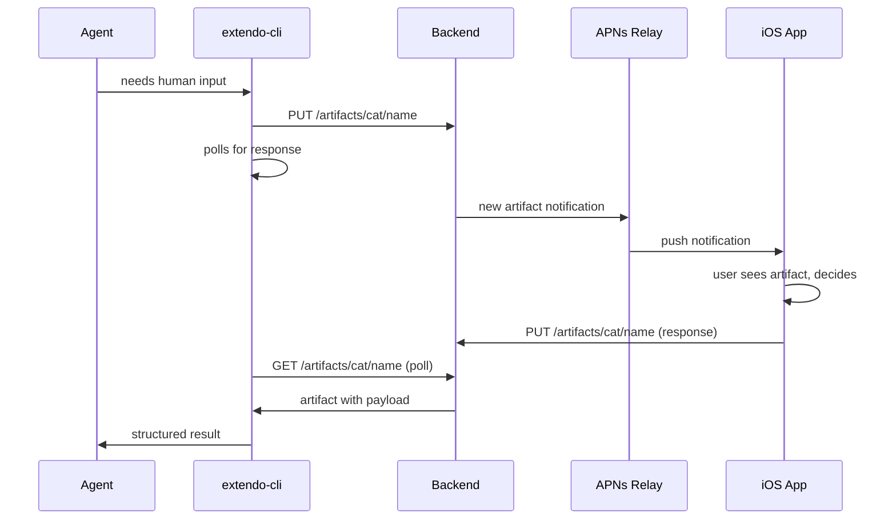
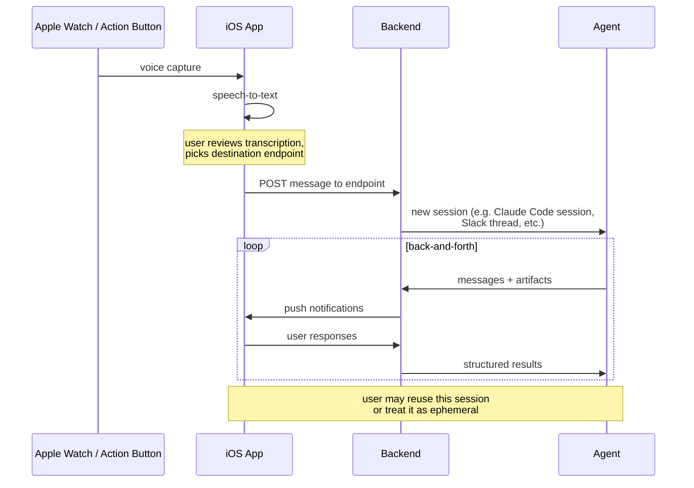

# Extendo CLI

**Human-in-the-loop decisions for AI agents.**

Extendo lets your agents ask humans for structured decisions — approvals, choices, reviews, prioritization — delivered as rich UI via mobile push notifications. The human responds on their phone; the agent gets structured JSON back and continues.

```bash
# Agent asks for deploy approval → user sees a yes/no card on their phone
./scripts/extendo artifact create ops deploy \
  --type yes_no --title "Deploy to prod?" \
  --prompt "All 847 tests pass. Ship it?" \
  --wait --json
```

```json
{ "payload": { "decision": true } }
```

No Slack threads. No email. No "reply YES to confirm." Purpose-built UI for each decision type.

### Quick idea capture

With a self-hosted backend, Extendo also works in the other direction. Capture ideas from your Apple Watch or iPhone's Action Button — speak a thought when inspiration strikes, and direct it to the right agent later. Start new Claude Code or Codex sessions in your repos, kick off Slack threads (handy for connecting to OpenClaw), or queue up ideas as conversation threads that agents can pick up and act on.

## Quickstart

### 1. Get the Extendo app

Extendo is an iOS app. Install it on your iPhone or iPad via TestFlight (invite link coming soon).

### 2. Connect to the public backend

Visit **[public.extendo.sh](https://public.extendo.sh)** to get an API token. Scan the QR code with the Extendo app on your phone to add the backend.

```bash
./scripts/extendo auth add public https://public.extendo.sh <your-token>
```

With the public backend, your agent can create artifacts and push them to your phone, then block until you respond. Everything in the [What can it do?](#what-can-it-do) section works out of the box. Limitations: the public backend uses on-device TTS (supply your own `GEMINI_API_KEY` for server-side TTS), and you can't initiate conversations from the app.

> **Self-hosting:** With a personal backend you can initiate new conversations with your agents right from the app — which makes the Apple Watch and Action Button quick-capture features genuinely useful. You also get server-side TTS, lower latency, and full control. See [extendo-backends](https://github.com/egradman/extendo-backends) for self-hosting on Cloudflare Workers or inside a Tailnet.

### 3. Try it

```bash
# Send a message to your phone
./scripts/extendo new test "Hello from the CLI!"

# Ask a yes/no question and wait for the answer
./scripts/extendo artifact create test first-decision \
  --type yes_no --title "Is it working?" --prompt "Tap approve if you see this." \
  --wait --json
```

### 4. Add the agent skill (optional)

Extendo includes a skill file (`SKILL.md`) that teaches AI agents how to use the CLI. Clone this repo and add it as a skill in your agent framework:

```bash
git clone https://github.com/egradman/extendo-cli.git
# Then add the skill directory to your agent's skill configuration
```

## What can it do?

### Messaging

Send messages to a human and wait for replies:

```bash
./scripts/extendo new project "Starting the auth refactor. I'll check in when I hit a decision point."
./scripts/extendo send project my-thread "Found 3 approaches. Creating a decision artifact."
./scripts/extendo wait project my-thread --timeout 300
```

### Structured Decisions

Create artifacts that render as purpose-built UI on the user's device. The agent blocks (or polls) until the user submits.

| Type | What the user sees | Use case |
|---|---|---|
| `yes_no` | Approve / Reject buttons | Deploy gates, destructive action confirmation |
| `multiple_choice` | Radio buttons or checkboxes | Model selection, strategy choice |
| `checklist` | Per-item approve/reject switches | Expense review, PR file-by-file approval |
| `ranking` | Drag-to-reorder list | Sprint prioritization, migration ordering |
| `categorize` | Kanban board (iPad) / collapsible sections (iPhone) | Bug triage, task bucketing |
| `document_review` | Per-paragraph annotation | RFC review, contract review |
| `dag` | Interactive directed graph | Architecture diagrams, dependency visualization |
| `progress_grid` | Colored status matrix | Sprint trackers, migration dashboards |

### Decision Gates

Block an agent workflow until a human decides:

```bash
# Create a conversation thread for context
THREAD=$(./scripts/extendo new ops "Requesting deploy approval for v2.3.1" --json | jq -r .endpoint.name)

# Create a linked yes/no gate — blocks until the user taps Approve or Reject
RESULT=$(./scripts/extendo artifact create ops deploy-v2 \
  --type yes_no \
  --title "Deploy v2.3.1 to production?" \
  --prompt "CI green. 847 tests pass. No regressions." \
  --conversation "ops:$THREAD" \
  --wait --json)

if [ "$(echo "$RESULT" | jq -r '.payload.decision')" = "true" ]; then
  echo "Deploying..."
else
  echo "Aborted."
fi
```

## Concepts

Extendo has two core primitives: **endpoints** and **artifacts**. Both are addressed by `category/name`.

**Endpoints** are chat threads — a sequence of messages between an agent and a human. An endpoint lives at `category/name` (e.g. `ops/deploy-v2`). Categories can map to whatever makes sense for your backend — Slack channels, repos, project names. Names identify a specific conversation within that category (a Slack thread, a Claude Code session, an OpenClaw session, etc.).

**Artifacts** are structured decisions — a typed payload (yes/no, checklist, ranking, etc.) that renders as purpose-built UI on the user's device. An artifact also lives at `category/name`.

An artifact can optionally **link to an endpoint** via `--conversation category:name`. When linked, the user sees a "Discuss" button on the artifact that jumps to the conversation, and the conversation shows a banner linking back to pending decisions. This lets you pair a rich decision UI with a free-form chat thread for context.

## CLI Reference

### Messaging

```bash
./scripts/extendo new <category> "message"              # Create a new thread
./scripts/extendo send <category> <name> "message"      # Send to existing thread
./scripts/extendo read <category> <name>                # Read messages
./scripts/extendo wait <category> <name> --timeout 300  # Block until reply
./scripts/extendo threads                               # List all threads
./scripts/extendo thread update <cat> <name> --title "..." --note "..."
```

Both `send` and `new` accept `--context <text>` or `--context-file <path>` to inject system context.

### Artifacts

```bash
./scripts/extendo artifact create <cat> <name> --type <type> --title <title> [options]
./scripts/extendo artifact get <cat> <name> [--wait] [--timeout <s>] [--json]
./scripts/extendo artifact update <cat> <name> --payload <json> | --payload-file <path>
./scripts/extendo artifact list [--status <status>] [--json]
./scripts/extendo artifact delete <cat> <name>
```

### Auth

Extendo supports multiple backends. Each backend has a name, URL, and API token. The first backend you add becomes the default.

```bash
# Add a backend (first one added becomes the default)
./scripts/extendo auth add public https://public.extendo.sh <your-token>

# Add another backend
./scripts/extendo auth add work https://extendo.your-company.com <work-token>

# List configured backends
./scripts/extendo auth list
#   public (default)  https://public.extendo.sh
#   work              https://extendo.your-company.com

# Switch the default
./scripts/extendo auth default work

# Use a specific backend for one command
./scripts/extendo send ops deploy "Shipping v2.3" -b public

# Remove a backend
./scripts/extendo auth remove public
```

Config is stored at `~/.config/extendo/config.json`.

### Global Flags

All commands accept: `--json`, `-b <name>` / `--backend <name>`, `--url <url>`, `--token <token>`

## Documentation

- **[SKILL.md](SKILL.md)** — Full skill reference for AI agents
- **[references/artifact-reference.md](references/artifact-reference.md)** — Complete artifact type guide with result shapes and jq snippets
- **[extendo-gate.md](extendo-gate.md)** — Decision gate patterns for agent workflows

## Architecture

Extendo is three components:

| Component | What it does | Repo |
|---|---|---|
| **extendo-cli** | CLI + agent skill. Sends messages and creates artifacts via HTTP API. | You're here |
| **extendo-backends** | Cloudflare Workers that store threads, artifacts, and send push notifications. Backends currently provided for Claude Code and Slack. | [extendo-backends](https://github.com/egradman/extendo-backends) |
| **Extendo iOS app** | iPhone/iPad app that renders artifacts as native UI and sends responses back. | Private (TestFlight) |

### Protocol (public backend)



### Quick capture (self-hosted backend)



## License

MIT
